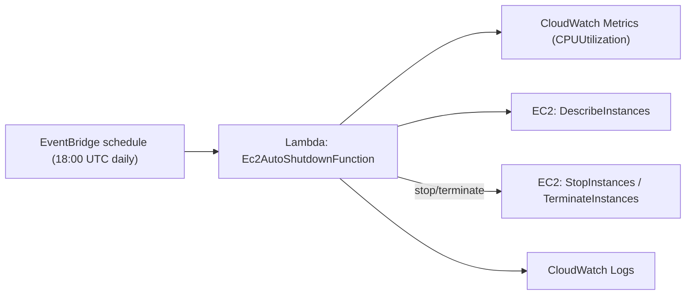

# EC2 Auto Shutdown (AWS CDK)

Shuts down (or terminates) idle EC2 instances based on CPU utilization.  
This project deploys a Lambda function and an EventBridge (CloudWatch Events) rule using AWS CDK. By default, the Lambda is triggered **daily at 18:00 UTC** and evaluates CPU usage to decide whether to stop or terminate instances.

> 📌 The Lambda runtime in this stack is **Python 3.13** and the handler lives at `ec2_auto_shutdown/lambda/handler.py`.

---

## How it works



1. **Schedule**: EventBridge triggers the Lambda once per day at 18:00 UTC (configurable).
2. **Discovery**: The Lambda lists target instances (optionally filtered by tag).
3. **Evaluation**: It queries CloudWatch `CPUUtilization` over a lookback window.
4. **Action**: Instances below a threshold are **stopped** (or **terminated**, if configured).
5. **Auditability**: All decisions are written to **CloudWatch Logs**.

---

## Repository structure

```
.
├─ bin/
│  └─ <your_app>.py                  # CDK app entrypoint
├─ lib/
│  └─ ec2_auto_shutdown_stack.py     # (Your class: Ec2AutoShutdownStack)
├─ ec2_auto_shutdown/
│  └─ lambda/
│     └─ handler.py                  # Lambda handler (implement logic here)
├─ cdk.json
├─ README.md                         # ← this file
└─ requirements.txt
```

---

## Lambda behavior (expected)

Implement your logic in `ec2_auto_shutdown/lambda/handler.py`. A typical flow:

- Read configuration from environment variables.
- `DescribeInstances` (optionally by tag).
- For each running instance:
  - Pull CloudWatch `CPUUtilization` for the last **LOOKBACK_MINUTES**.
  - If **average CPU < CPU_THRESHOLD**, take **ACTION** (`stop` or `terminate`).
  - Respect **DRY_RUN** to preview actions safely.

### Suggested environment variables

| Variable            | Default | Description |
|---|---:|---|
| `CPU_THRESHOLD`     | `5`    | Average CPU (percent) below which the instance is considered idle. |
| `LOOKBACK_MINUTES`  | `60`   | How far back to analyze CPU. |
| `ACTION`            | `stop` | `stop` or `terminate`. |
| `TAG_KEY`           | _(none)_ | If set, only consider instances with this tag key. |
| `TAG_VALUE`         | _(none)_ | If set, match `TAG_KEY=TAG_VALUE`. |
| `DRY_RUN`           | `true` | `true` = log only; `false` = perform the action. |
| `EXCLUDE_INSTANCE_IDS` | _(none)_ | Comma-separated instance IDs to never touch. |

---

## Prerequisites

- **AWS Account**
- **AWS CDK v2**
- **Node.js**
- **Python 3.10+**
- Properly configured AWS credentials.

---

## Setup & deployment

```bash
npm install -g aws-cdk
python -m venv .venv && source .venv/bin/activate
pip install -r requirements.txt
cdk bootstrap
cdk synth
cdk deploy
```

---

## Minimal Lambda handler template

```python
import os, boto3, datetime
from statistics import mean

ec2 = boto3.client("ec2")
cloudwatch = boto3.client("cloudwatch")

CPU_THRESHOLD = float(os.getenv("CPU_THRESHOLD", "5"))
LOOKBACK_MINUTES = int(os.getenv("LOOKBACK_MINUTES", "60"))
ACTION = os.getenv("ACTION", "stop").lower()
DRY_RUN = os.getenv("DRY_RUN", "true").lower() == "true"
TAG_KEY = os.getenv("TAG_KEY")
TAG_VALUE = os.getenv("TAG_VALUE")
EXCLUDE = set((os.getenv("EXCLUDE_INSTANCE_IDS") or "").split(",")) if os.getenv("EXCLUDE_INSTANCE_IDS") else set()

def lambda_handler(event, context):
    filters = [{"Name": "instance-state-name", "Values": ["running"]}]
    if TAG_KEY and TAG_VALUE:
        filters.append({"Name": f"tag:{TAG_KEY}", "Values": [TAG_VALUE]})
    elif TAG_KEY:
        filters.append({"Name": f"tag-key", "Values": [TAG_KEY]})

    reservations = ec2.describe_instances(Filters=filters)["Reservations"]
    instances = [i for r in reservations for i in r["Instances"]]
    now = datetime.datetime.utcnow()
    start = now - datetime.timedelta(minutes=LOOKBACK_MINUTES)

    acted = []
    for inst in instances:
        iid = inst["InstanceId"]
        if iid in EXCLUDE:
            continue

        metrics = cloudwatch.get_metric_statistics(
            Namespace="AWS/EC2",
            MetricName="CPUUtilization",
            Dimensions=[{"Name": "InstanceId", "Value": iid}],
            StartTime=start,
            EndTime=now,
            Period=300,
            Statistics=["Average"],
            Unit="Percent",
        )
        datapoints = [dp["Average"] for dp in metrics.get("Datapoints", [])]
        avg_cpu = mean(datapoints) if datapoints else 0.0

        if avg_cpu < CPU_THRESHOLD:
            if ACTION == "terminate":
                ec2.terminate_instances(InstanceIds=[iid], DryRun=DRY_RUN)
            else:
                ec2.stop_instances(InstanceIds=[iid], DryRun=DRY_RUN)
            acted.append((iid, avg_cpu))

    return {"checked": len(instances), "acted_on": acted, "dry_run": DRY_RUN}
```

---

## Required IAM permissions

```json
{
  "Version": "2012-10-17",
  "Statement": [
    {"Effect": "Allow", "Action": ["ec2:DescribeInstances"], "Resource": "*"},
    {"Effect": "Allow", "Action": ["ec2:StopInstances","ec2:TerminateInstances"], "Resource": "*"},
    {"Effect": "Allow", "Action": ["cloudwatch:GetMetricStatistics","cloudwatch:GetMetricData"], "Resource": "*"},
    {"Effect": "Allow", "Action": ["logs:CreateLogGroup","logs:CreateLogStream","logs:PutLogEvents"], "Resource": "*"}
  ]
}
```

---

## Cleanup

```bash
cdk destroy
```

---

## License

MIT
